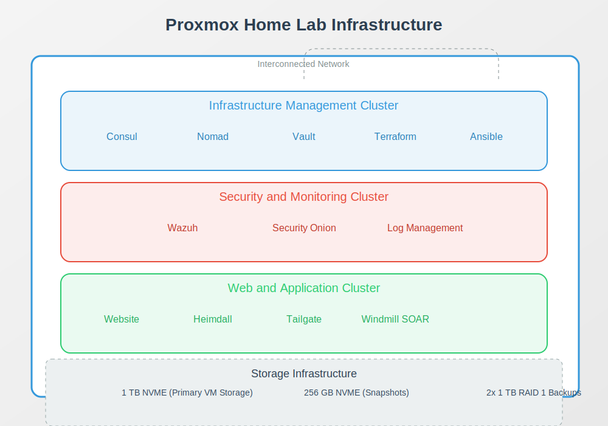
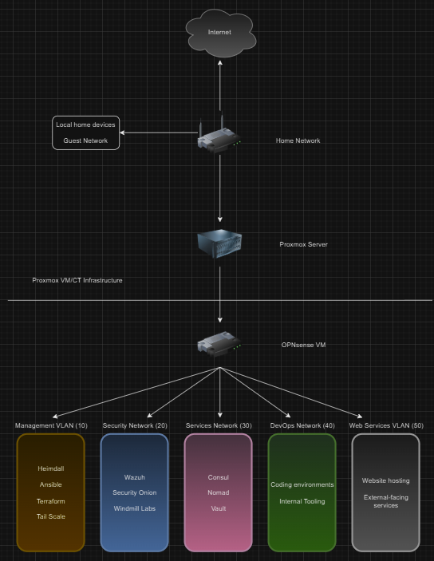

# Home Lab Proxmox Server Infrastructure

## 🖥️ Server Specifications
- **RAM:** 64 GB
- **CPU:** 56 cores (24 cores, 2 threads per core)
- **Storage:**
  - 2 x 1 TB HDD (RAID 1 - Long-term Backups)
  - 2 x 512 GB SSD (RAID 1)
  - 1 x 256 GB SSD NVME (Snapshot Storage)
  - 1 x 1 TB NVME (Primary Proxmox Installation and VM/Container Host)

## 🏗️ Infrastructure Architecture Diagram




### Cluster Breakdown

#### 1. Infrastructure Management Cluster
- [Consul](https://www.consul.io/) - Service Discovery
- [Nomad](https://www.nomadproject.io/) - Workload Orchestration
- [Vault](https://www.vaultproject.io/) - Secrets Management
- [Terraform](https://www.terraform.io/) - Infrastructure as Code
- [Ansible](https://www.ansible.com/) - Configuration Management

#### 2. Security and Monitoring Cluster
- [Wazuh](https://wazuh.com/) or [Security Onion](https://securityonion.net/) - Security Monitoring
- Additional Monitoring Tools

#### 3. Web and Application Cluster
- Website Hosting
- [Heimdall](https://github.com/linuxserver/Heimdall) - Dashboard
- [Tailscale](https://tailscale.com/) - Access Management
- [Windmill](https://www.windmill.dev/) - SOAR Platform

## 🚀 Deployment Strategy

### Containerization Approach
- Lightweight services: LXC Containers
- Complex services: Virtual Machines
- Docker/Podman for additional containerization

## 📂 Repository Structure
```
.
├── ansible/                 # Ansible playbooks
├── terraform/               # Terraform configuration files
├── nomad/                   # Nomad job specifications
├── consul/                  # Consul configuration
├── vault/                   # Vault configuration
├── monitoring/              # Monitoring tool configurations
├── web/                     # Web application configurations
└── README.md                # This file
```

## 🛠️ Provisioning and Management

### Prerequisites
- Proxmox VE installed
- SSH access configured
- Basic networking setup completed

### Provisioning Steps
1. Clone this repository
2. Configure Terraform variables
3. Initialize Consul/Nomad/Vault clusters
4. Deploy monitoring infrastructure
5. Set up web and application services

## 🔒 Security Considerations
- Implement network segmentation
- Use Vault for secrets management
- Regular security updates
- Implement least privilege access

## 📈 Resource Allocation
- Infrastructure Cluster: 8-12 GB RAM
- Security Cluster: 12-16 GB RAM
- Web/App Cluster: 8-12 GB RAM

## 🤝 Contributing
1. Fork the repository
2. Create your feature branch (`git checkout -b feature/AmazingFeature`)
3. Commit your changes (`git commit -m 'Add some AmazingFeature'`)
4. Push to the branch (`git push origin feature/AmazingFeature`)
5. Open a Pull Request


## 🚧 Disclaimer
This is a home lab setup. Ensure proper security measures and do not expose services directly to the internet without proper protection.

